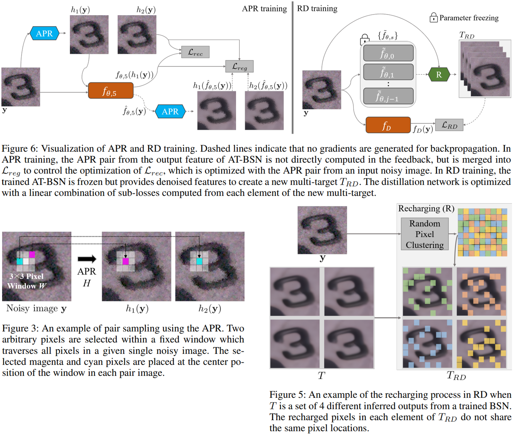

## -- The final code review is underway, and the project page is scheduled to be completed on March 3rd. We apologize for any inconvenience and appreciate your patience. --

# APR-RD: Complemental Two Steps for Self-Supervised Real Image Denoising

## Introduction
The project provides the official PyTorch implementation with pretrained models for the paper "APR-RD: Complemental Two Steps for Self-Supervised Real Image Denoising" (AAAI 2025).    

<p align="center"></p>

## Abstract
Recent advancements in self-supervised denoising have made it possible to train models without needing a large amount of noisy-clean image pairs. A significant development in this area is the use of blind-spot networks (BSNs), which use single noisy images as training pairs by masking some input information to prevent noise transmission to the network output. Researchers have shown that BSNs are capable of reconstructing clean pixels from various types of independent pixel-wise degradations, such as synthetic additive white Gaussian noise (AWGN). However, unlike synthetic noise, real noise often contains highly correlated components which can induce noise transmission and reduce the performance of BSNs. To address the spatial correlation of real noise, we propose the Adjacent Pixel Replacer (APR), which decorrelates noise without a downsampling process that is widely adopted in previous research. The dissimilarity in our APR-generated pairs serves as relatively different noise components during training. Hence, it enables the BSN to block noise transmission while utilizing clean information effectively. As a result, BSN can utilize denser information to reconstruct the corresponding center pixel. We also propose Recharged Distillation (RD) to enhance high-frequency textures without additional network modifications. This method selectively refines clean information from recharged noisy pixels during distillation. Extensive experimental results demonstrate that our proposed method outperforms the existing state-of-the-art self-supervised denoising methods in real sRGB space.

## Visual Results
Visual comparison with recent self-supervised methods.

<p align="center"></p>

## Environment
- Ubuntu 20.04.5 LTS
- Python 3.8.10
- Pytorch 1.12.1 (CUDAtoolkit=11.3)
- RTX 2080ti * 2ea

## GitHub Structure
We provide two versions of the code and their corresponding training results.
Before our AAAI submission, we implemented a 1.02M NBSN (Student C) based on the description in the AT-BSN paper (Exploring Efficient Asymmetric Blind-Spots for Self-Supervised Denoising in Real-World Scenarios, CVPR 2024).
However, we found that their GitHub repository, which was made public after our submission, implements a 1.00M NBSN and states that the description in their paper was a typo.
Therefore, we provide both the results and code for the 1.02M NBSN version, as stated in our paper, as well as the results and code for the 1.00M NBSN version, which we retrained after our submission.
These are included as `NBSN_1.00M` and `NBSN_1.02M`, respectively.

## Code Structure
```
├─ codes/
│    ├─ dataset/
│    │    └─ README.md             # Download each dataset and organize them according to the given instructions.
│    │    
│    ├─ network/                 
│    │    ├─ __init__.py   
..   │    ├─ baseline_network.py   # Network modules of AT-BSN and NBSN
     │    └─ multi_target_T        # Inference module for obtaining multi-target T from the trained AT-BSN.
     │
     ├─ utils/
     │    ├─ __init__.py
     │    ├─ dataloader.py    # Dataset Loaders for training and inference
     │    ├─ function.py      # Modules for the proposed methods, APR and Recharger.
     │    ├─ metric.py        # Functions for PSNR and SSIM calculation
     │    └─ utility.py       # Loss functions, scheduler
     │
     ├─ config.json     # GPU settings, data and result paths, training hyperparameters, etc.
     ├─ preparation.py  # Modularization of train, test, and validation.
     ├─ train.py        # Model initialization, loading training data, and training execution.
     ├─ test.py         # Loading trained model, loading test data, and test execution.
     └─ validate.py     # Evaluation execution for SIDD Validation.
```

## Dataset
Prepare the [SIDD dataset](https://abdokamel.github.io/sidd/)  
-SIDD Medium: Download `sRGB images only (~12 GB)`.  
-SIDD Validation: Download `Noisy sRGB data` and `Ground-truth sRGB data` from `SIDD Validation Data and Ground Truth`.  
-SIDD Benchmark: Download `SIDD Benchmark Data (full-frame images, 1.84 GB)`
                 and `Noisy sRGB data` from `SIDD Benchmark Data`.  
Prepare the [DND dataset](https://noise.visinf.tu-darmstadt.de/downloads/)  
-DND Benchmark: Download `Benchmark data` (12.8 GB).  

For training and evaluation using our code, organize the above prepared datasets as follows.   
```
dataset/
   ├─ SIDD_Medium_Srgb/
   │    ├─ Data/
   │    │    ├─ 0001_001_S6_00100_00060_3200_L/
   │    │    │    ├─ 0001_GT_SRGB_010.png
   │    │    │    ├─ 0001_GT_SRGB_011.png
   │    │    │    ├─ 0001_NOISY_SRGB_010.png
   │    │    │    └─ 0001_NOISY_SRGB_011.png
   │    │    ..
   │    │    └─ 0200_010_GP_01600_03200_5500_N/
   │    │         ├─ 0200_GT_SRGB_010.png
   │    │         ├─ 0200_GT_SRGB_011.png
   │    │         ├─ 0200_NOISY_SRGB_010.png
   │    │         └─ 0200_NOISY_SRGB_011.png
   │    ├─ ReadMe_sRGB.txt
   │    └─ Scene_Instances.txt
   │
   ├─ SIDD_Validation_sRGB/
   │    ├─ ValidationGtBlocksSrgb.mat
   │    └─ ValidationNoisyBlocksSrgb.mat
   │
   ├─ SIDD_Benchmark_Data
   │    ├─ 0009_001_S6_00800_00350_3200_L
   │    │    ├─ 0009_METADATA_RAW_010
   │    │    ├─ 0009_NOISY_RAW_010
   │    │    └─ 0009_NOISY_SRGB_010
   │    ..
   │    └─ 0187_008_IP_01600_01600_3200_L 
   │         ├─ 0187_METADATA_RAW_010
   │         ├─ 0187_NOISY_RAW_010
   │         └─ 0187_NOISY_SRGB_010
   │
   ├─ SIDD_Benchmark_sRGB/
   │    └─ BenchmarkNoisyBlocksSrgb.mat
   │
   └─ dnd_2017/
        ├─ images_raw
        │    ├─ 0001.mat
        │    ├─ 0002.mat
        │    ..
        │    └─ 00050.mat
        ├─ images_srgb
        │    ├─ 0001.mat
        │    ├─ 0002.mat
        │    ..
        │    └─ 00050.mat
        ├─ info.mat
        └─ pixelmasks.mat
```

## Train, Test and Validation  
Trainig of APR(BSN) and RD(NBSN) using SIDD Medium.  
-Each traiend model will be stored as `../trained/BSN_SIDD_Medium.pth` and `../trained/NBSN_SIDD_Medium.pth`.  
-If you want to train with other datasets, please refer to the comments in the file.
```shell
python train.py
```

Test on SIDD Validation, Benchmark, and DND Benchmark using the two trained models.  
-Loading the (pre-trained) model parameters stored as `../pretrained/BSN_SIDD_Medium.pth` and `../pretrained/NBSN_SIDD_Medium.pth`.  
-Each result will be stored in  
`../result/BSN/train_SIDD_Medium/test_SIDD_Validation`  
&nbsp;&nbsp;&nbsp;&nbsp;&nbsp;&nbsp;&nbsp;&nbsp;&nbsp;&nbsp;&nbsp;&nbsp;&nbsp;&nbsp;&nbsp;&nbsp;&nbsp;&nbsp;&nbsp;&nbsp;&nbsp;&nbsp;&nbsp;&nbsp;&nbsp;&nbsp;&nbsp;&nbsp;&nbsp;&nbsp;&nbsp;&nbsp;&nbsp;&nbsp;&nbsp;&nbsp;&nbsp;&nbsp;&nbsp;&nbsp;&nbsp;&nbsp;&nbsp;&nbsp;&nbsp;&nbsp;&nbsp;&nbsp;&nbsp;&nbsp;&nbsp;&nbsp;&nbsp;`/test_SIDD_Benchmark`  
&nbsp;&nbsp;&nbsp;&nbsp;&nbsp;&nbsp;&nbsp;&nbsp;&nbsp;&nbsp;&nbsp;&nbsp;&nbsp;&nbsp;&nbsp;&nbsp;&nbsp;&nbsp;&nbsp;&nbsp;&nbsp;&nbsp;&nbsp;&nbsp;&nbsp;&nbsp;&nbsp;&nbsp;&nbsp;&nbsp;&nbsp;&nbsp;&nbsp;&nbsp;&nbsp;&nbsp;&nbsp;&nbsp;&nbsp;&nbsp;&nbsp;&nbsp;&nbsp;&nbsp;&nbsp;&nbsp;&nbsp;&nbsp;&nbsp;&nbsp;&nbsp;&nbsp;&nbsp;`/test_DND_Benchmark`  
`../result/NBSN/train_SIDD_Medium/test_SIDD_Validation`  
&nbsp;&nbsp;&nbsp;&nbsp;&nbsp;&nbsp;&nbsp;&nbsp;&nbsp;&nbsp;&nbsp;&nbsp;&nbsp;&nbsp;&nbsp;&nbsp;&nbsp;&nbsp;&nbsp;&nbsp;&nbsp;&nbsp;&nbsp;&nbsp;&nbsp;&nbsp;&nbsp;&nbsp;&nbsp;&nbsp;&nbsp;&nbsp;&nbsp;&nbsp;&nbsp;&nbsp;&nbsp;&nbsp;&nbsp;&nbsp;&nbsp;&nbsp;&nbsp;&nbsp;&nbsp;&nbsp;&nbsp;&nbsp;&nbsp;&nbsp;&nbsp;&nbsp;&nbsp;&nbsp;&nbsp;`/test_SIDD_Benchmark`  
&nbsp;&nbsp;&nbsp;&nbsp;&nbsp;&nbsp;&nbsp;&nbsp;&nbsp;&nbsp;&nbsp;&nbsp;&nbsp;&nbsp;&nbsp;&nbsp;&nbsp;&nbsp;&nbsp;&nbsp;&nbsp;&nbsp;&nbsp;&nbsp;&nbsp;&nbsp;&nbsp;&nbsp;&nbsp;&nbsp;&nbsp;&nbsp;&nbsp;&nbsp;&nbsp;&nbsp;&nbsp;&nbsp;&nbsp;&nbsp;&nbsp;&nbsp;&nbsp;&nbsp;&nbsp;&nbsp;&nbsp;&nbsp;&nbsp;&nbsp;&nbsp;&nbsp;&nbsp;&nbsp;&nbsp;`/test_DND_Benchmark`.  
-If you want to test a model trained on other datasets or test the model you trained, please refer to the comments in the file.
```shell
python test.py
```

Validation  
-Calculation of PSNR and SSIM for the test results of SIDD Validation.  
-SIDD Benchmark and DND Benchmark require separate processing for submission (refer to their websites).  
```shell
python validate.py
```

## Acknowledgements
This project is based on the following open-source projects. In particular, we benefit from the convenience of using the network of AT-BSN code as it is. We sincerely appreciate their authors for allowing us to use their excellent works as open-source.
- [AT-BSN](https://github.com/hnmizuho/AT-BSN)
- [SIDD](https://abdokamel.github.io/sidd/)
- [DND](https://noise.visinf.tu-darmstadt.de/)
